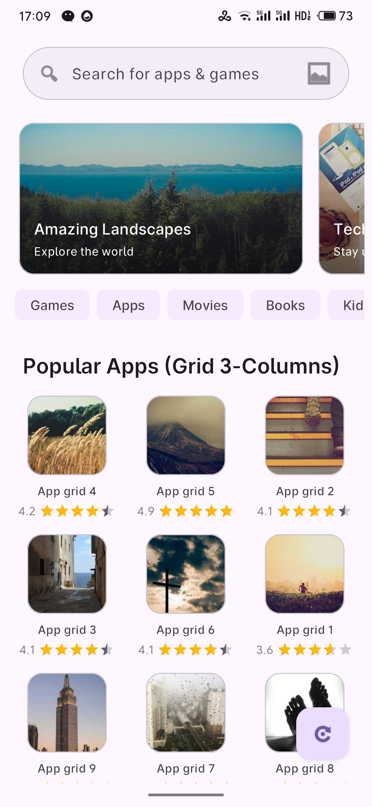
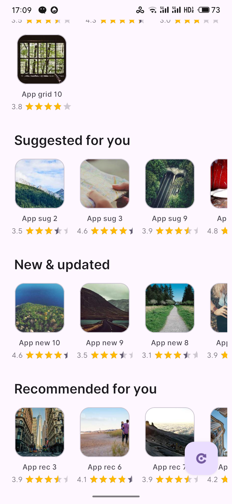

# 🌌 Verses

[中文](README.zh-CN.md) | English

**Verses** is a minimalist, industrial-grade declarative UI engine for Android RecyclerView. It brings the expressive power of Jetpack Compose DSL to the mature and stable world of RecyclerView, enabling you to build complex, high-performance lists with 80% less code.

[](https://search.maven.org/artifact/io.github.woniu0936/verses)
[](https://opensource.org/licenses/Apache-2.0)

<div align="center">
  <table>
    <tr>
      <td align="center">
        <br>
        <i>Linear & Grid Mixed</i>
      </td>
      <td align="center">
        <br>
        <i>Nested Horizontal Lists</i>
      </td>
    </tr>
  </table>
</div>

## 💎 Why Verses?

- **🚀 Performance Peak**: Built on `ListAdapter` and `AsyncListDiffer` with optimized background diffing.
- **🛡️ Industrial-Grade Safety**: Instance-local factories and thread-safe ViewType generation to prevent Context leaks.
- **✨ Compose-like Syntax**: Write UI, not boilerplate. No more manual `Adapter` or `ViewHolder` subclasses.
- **🧩 Extreme Flexibility**: Native support for `ViewBinding`, programmatic `Custom Views`, and `contentType` styling.
- **📦 Transparent Optimization**: Context-scoped shared pools for efficient view recycling across fragments/activities.

## 📦 Installation

```kotlin
dependencies {
    implementation("io.github.woniu0936:verses:1.1.0")
}
```

## 📖 Complete API & Capability Showcase

Verses provides a unified DSL to handle all your list requirements.

### 1. The "Kitchen Sink" Example (Comprehensive)
```kotlin
recyclerView.composeVerticalGrid(
    spanCount = 2,
    spacing = 16.dp,             // Internal item spacing
    contentPadding = 20.dp       // Outer list padding
) {
    // A. Single ViewBinding Item (Full Span)
    item(ItemHeaderBinding::inflate, fullSpan = true) {
        tvTitle.text = "Comprehensive Demo"
    }

    // B. Custom View Item (Programmatic)
    item(create = { context -> MyCustomHeader(context) }) {
        // 'this' is MyCustomHeader
        setTitle("Section A")
    }

    // C. Standard List (ViewBinding) with Best Practices
    items(
        items = userList,
        inflate = ItemUserBinding::inflate,
        key = { it.id },
        span = 1,
        // ✅ Root Click: Use 'onClick' parameter (Zero allocation)
        onClick = { user -> toast("Clicked ${user.name}") },
        // ✅ Child Click: Use 'onCreate' for one-time initialization
        onCreate = {
            btnFollow.setOnClickListener {
                val user = itemData<User>() // Lazy access data
                viewModel.follow(user)
            }
        }
    ) { user ->
        // onBind: Only update visual state
        tvName.text = user.name
        btnFollow.text = if (user.isFollowed) "Unfollow" else "Follow"
    }

    // D. Multi-Type rendering with logic
    items(feedList, key = { it.id }) { feed ->
        when (feed) {
            is Banner -> render(ItemBannerBinding::inflate, fullSpan = true) {
                ivBanner.load(feed.url)
            }
            // Use 'contentType' to differentiate styles for the same Binding class
            is Ad -> render(ItemPostBinding::inflate, contentType = "ad_style") {
                tvContent.text = "Sponsored: ${feed.text}"
                root.setBackgroundColor(Color.YELLOW)
            }
            is Post -> render(
                inflate = ItemPostBinding::inflate,
                onClick = { toast("Post: ${feed.text}") }
            ) {
                tvContent.text = feed.text
            }
        }
    }

    // E. Horizontal Nested List (Automatic Pool Optimization)
    item(ItemHorizontalListBinding::inflate, fullSpan = true) {
        rvNested.composeRow(spacing = 8.dp, horizontalPadding = 16.dp) {
            items(categories, ItemCategoryBinding::inflate) { cat ->
                tvCategory.text = cat.name
            }
        }
    }
}
```

### 2. API Naming Mapping (The Naming Mapping)

We have aligned our API naming with Jetpack Compose (removing the "Lazy" prefix) to minimize cognitive load.

| Native RecyclerView | Orientation | **Verse API** | **Jetpack Compose Equivalent** |
| :--- | :--- | :--- | :--- |
| `Linear (LinearLayoutManager)` | Vertical | **`composeColumn`** | `LazyColumn` |
| `Linear (LinearLayoutManager)` | Horizontal | **`composeRow`** | `LazyRow` |
| `Grid (GridLayoutManager)` | Vertical | **`composeVerticalGrid`** | `LazyVerticalGrid` |
| `Grid (GridLayoutManager)` | Horizontal | **`composeHorizontalGrid`** | `LazyHorizontalGrid` |
| `Staggered (StaggeredGridLayoutManager)` | Vertical | **`composeVerticalStaggeredGrid`** | `LazyVerticalStaggeredGrid` |
| `Staggered (StaggeredGridLayoutManager)` | Horizontal | **`composeHorizontalStaggeredGrid`** | `LazyHorizontalStaggeredGrid` |

### 3. Global Configuration & Diagnostics (Industrial-Grade)

Verses provides a robust diagnostic system to help you debug complex list behaviors and track production errors.

#### A. Initialization (Kotlin DSL)
Initialize Verses in your `Application` class to enable global features.
```kotlin
Verses.initialize(this) {
    debug(true)           // Enable internal lifecycle/diff logging
    logTag("MyApp")       // Custom Logcat tag
    logToFile(true)       // Persistence for diagnostic sharing
    
    // Production Error Telemetry
    onError { throwable, message ->
        // Bridge to Sentry / Crashlytics
        FirebaseCrashlytics.getInstance().recordException(throwable)
    }
}
```

#### B. Java Compatibility (Builder Pattern)
```java
VersesConfig config = new VersesConfig.Builder()
    .debug(true)
    .logToFile(true)
    .onError((throwable, msg) -> { /* Handle error */ })
    .build();
Verses.initialize(context, config);
```

#### C. Low-Cost Debugging
When a user reports a bug, you can use the built-in utility to let them share the diagnostic log:
```kotlin
// Get the raw intent for maximum customization
val shareIntent = Verses.getShareLogIntent(context)
startActivity(Intent.createChooser(shareIntent, "Share Log"))

// OR use the helper provided in verses-sample:
// ShareUtils.shareLogFile(context)
```

### 4. Advanced Performance Tuning

Verses introduces model-driven architecture and asynchronous pre-inflation to achieve 60 FPS even with extremely complex layouts.

#### A. Model-Driven Architecture (VerseModel)
For complex business logic that needs to be decoupled from the DSL, you can implement `VerseModel` directly.

```kotlin
class MyCustomModel(id: Any, data: MyData) : ViewBindingModel<ItemUserBinding, MyData>(id, data) {
    override fun inflate(inflater: LayoutInflater, parent: ViewGroup) = 
        ItemUserBinding.inflate(inflater, parent, false)

    override fun bind(binding: ItemUserBinding, item: MyData) {
        binding.tvName.text = item.name
    }
    
    override fun getSpanSize(totalSpan: Int, position: Int) = 1
}
```

#### B. Asynchronous Pre-inflation (VersePreloader)
Eliminate `CreateViewHolder` lag by pre-inflating views during idle time (e.g., while waiting for a network response).

```kotlin
// Pre-inflate 5 instances of each type to the global pool
VersePreloader.preload(
    context = this,
    models = listOf(
        MyCustomModel("template", MyData()),
        // ... other templates
    ),
    countPerType = 5
)
```

#### C. Enabling Async Pre-inflation in DSL
To enable `VersePreloader` for items created via DSL, you must provide the `layoutRes` parameter.

```kotlin
recyclerView.composeColumn {
    items(
        items = userList,
        inflate = ItemUserBinding::inflate,
        layoutRes = R.layout.item_user, // Required for async preload
        key = { it.id }
    ) { user ->
        tvName.text = user.name
    }
}
```

#### D. Automatic Pool Optimization
Verses automatically uses a **Global Shared RecycledViewPool**. This ensures that nested RecyclerViews (like horizontal lists inside a vertical list) share ViewHolders, drastically reducing memory usage and inflation overhead.

### 5. Global Lifecycle & Resource Management
Verses automatically cleans up when the View is detached or the Activity is destroyed. To manually wipe all registries (e.g., on Logout):
```kotlin
VerseAdapter.clearRegistry()
```

### ⚠️ Performance Note
The `onBind` and `onClick` logic updates rely on `data` changes. If your `data`'s `equals` returns true, the UI will not re-bind. Use `data.copy()` if you need to force a refresh.

License
-------

    Copyright 2025 Woniu0936

    Licensed under the Apache License, Version 2.0 (the "License");
    you may not use this file except in compliance with the License.
    You may obtain a copy of the License at

       http://www.apache.org/licenses/LICENSE-2.0

    Unless required by applicable law or agreed to in writing, software
    distributed under the License is distributed on an "AS IS" BASIS,
    WITHOUT WARRANTIES OR CONDITIONS OF ANY KIND, either express or implied.
    See the License for the specific language governing permissions and
    limitations under the License.
